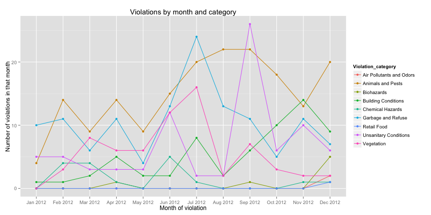

Violations
========================================================

We looked into violation types from the given data.


To visualize this, we use:


```r
ggplot(findat, aes(x = dts, y = tt, colour = Violation_category, group=Violation_category)) +
  geom_point() + geom_line() + 
  xlab("Month of violation") + 
  ylab("Number of violations in that month") +
  ggtitle("Violations by month and category")
```

 


To make this graph, we counted the number of violations of each category that happened in each month of the year.  The months are plotted sequentially on the x-axis, and the number of violations in that month are plotted on the y-axis. Colors indicate the category of the violation.

From this graph we can see that the trend of violations over the course of the year. The most common issue categories we see appear to be Animals and Pests, Garbage and Refuse, and Unsanitary Conditions.  We can also see that some of these issues seem to follow trends over the year. Violations in Garbage and Refuse, for example, spike in the summer month of July, as with Vegetation violations. Unsanitary Conditions tend to spike in September.  Animals and Pests became a larger problem as the year went on, but fell of near the end of the year.  Violations with Building Conditions grew in frequency over the course of the year.

## Predicting next events
To predict the next occurrence of an event, we will build a simple numerical model that takes into account historical data. Since we only have one years' worth of data, we can't capture periodic effects well, and will assume that the occurence of events happens somewhat uniformly. The distribution that best describes this is the Poisson distribution.  Given a violation type, we will fit a poisson model to the time spent waiting between past events, to give an estimate of how long we should expect until the next violation.


```r
library(MASS)

prediction_violation <- function(viol_type){
  #grab and order relevant dates; compute time differences
  dates <- dat$date[dat$violation_type==viol_type]
  if(length(dates)<1){
    print("Bad violation type entered, or not enough data."); 
    break
  } else if (length(dates)<2){
    expected_time <- "180" # if it happened once in the year, this is our prediction
  }else{
    ordered_dates <- dates[order(dates)]
    time_diff <- as.integer(ordered_dates[-1] - ordered_dates[-length(ordered_dates)]) / 86400
    
    #fit a poisson model to the waiting times; print it out
    expected_time <- fitdistr(time_diff, "poisson")$estimate
    expected_time <- round(expected_time, 2)
  }
  out <- paste("We should expect to wait", expected_time, "days until the next", viol_type, "violation.")
  print(out)
}
```

We can test it out by trying it on a few issue types:


```r
prediction_violation("Abandoned Vehicle")
```

```
## [1] "We should expect to wait 16.25 days until the next Abandoned Vehicle violation."
```

```r
prediction_violation("Insects, not specified")
```

```
## [1] "We should expect to wait 7.59 days until the next Insects, not specified violation."
```

```r
prediction_violation("Pidgeons")
```

```
## [1] "We should expect to wait 180 days until the next Pidgeons violation."
```


